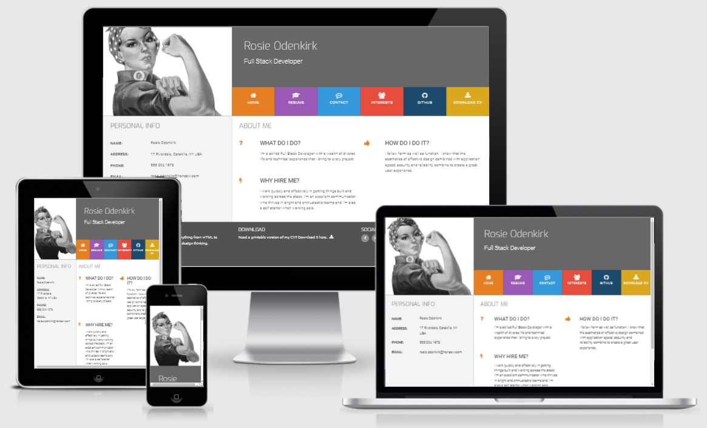

## Welcome from MaggieDaisy

This little project was created in the middle of my coding journey with Code Institute. 
It uses simple front-end technology like HTML, CSS, and JS

[**You can view live site here**]()

### Project aim: 
> Create an interactive CV that shows dev skills 

> Pages:
- Home - landing page with image, personal information, and intro 
- Resume - tech skills and educational information
- Contact - contact form
- Interest - skills developed in a spare time
- GitHub - links provided to Github pages 
